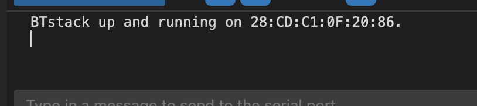
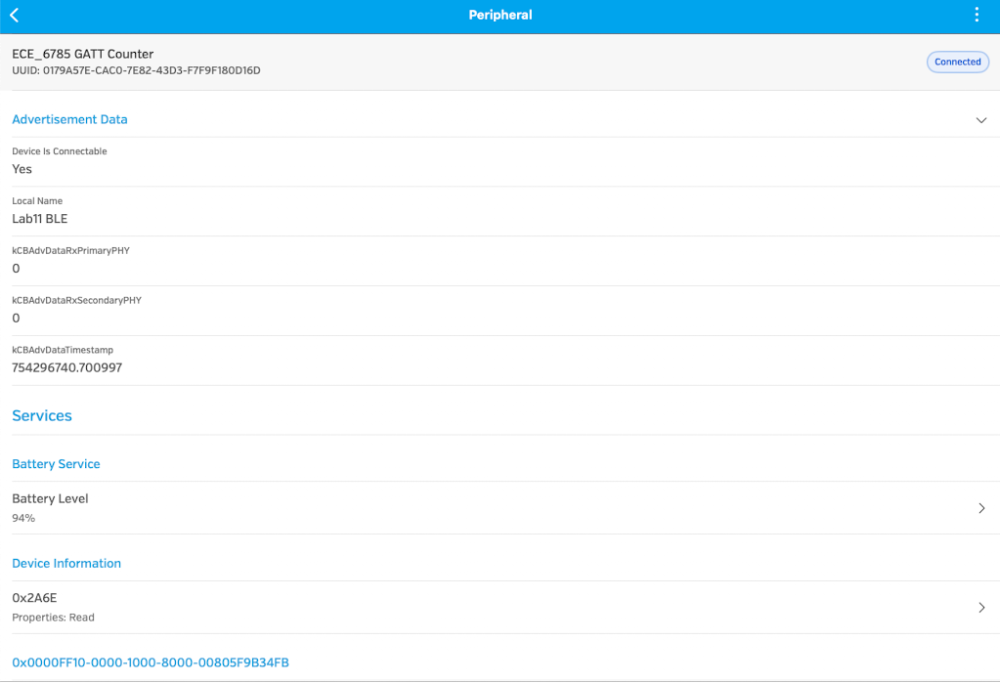
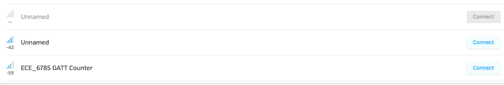
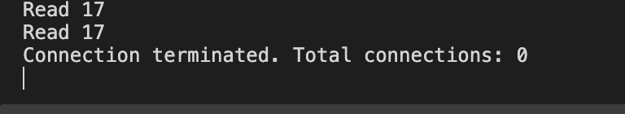
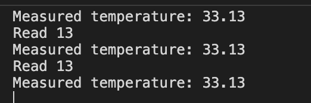

# Lab 11 Wireless communication with Bluetooth

## Activity - advertising

### Feature request
Our device uses a generic name when advertising. We need to distinguish ourselves from other devices.

#### Tasks

1. Modify the service to make it easier to identify your device. In the `gatt_counter.c` file, modify the `adv_data` array, which contains the advertisement data.
   * The advertisement data consists of a set of fields.
   * Each field begins with the number of bytes (including the type byte)
   * The field type is `BLUETOOTH_DATA_TYPE_COMPLETE_LOCAL_NAME` 0x09
   * The remaining data is UTF8 bytes.
   * You can see more details in the [specification](https://www.bluetooth.com/wp-content/uploads/Files/Specification/HTML/CSS_v11/out/en/supplement-to-the-bluetooth-core-specification/data-types-specification.html)
1. Flash the program to your microcontroller. When you connect to the serial port, it should print out a message with the device address. "BTstack up and running on 28:CD:C1:0F:1D:DC."

1. You should see your device advertised with the name you specified.

## Activity - attributes, services, and characteristics.

### Feature request
Customers can find our device with a unique name now, but it doesn't use a unique name when the device service is queried.

### Tasks
1. Connect to your device with your phone and look at what are the services the device provides.
    1. Note the properties of each service.
    1. Read the value from some services.
1. BTStack uses a custom domain specific language to define the services your device offers.
    1. In `include/gatt_counter.gatt` you'll find the definitions of each of the services.
    1. Many services are general purpose, such as the battery service included.
    1. When the project is compiled, a CMake macro provided by BTStack will generate a header file with C code based on the gatt file.
1. Find the `GAP_SERVICE` and modify the `GAP_DEVICE_NAME` device characteristic. The characteristic has type `GAP_DEVICE_NAME`, is read only, and includes a literal string value.
    1. Characteristics and services have a globally unique defined type and identity, set by the Bluetooth standard.
    1. Custom characteristics and services are allowed to be specified with a universally unique identifier (UUID). The counter service is an example of this.
1. Flash your controller and see if the service has changed.

## Activity - HCI packet handling.

### Feature request
We need to improve our debugging by logging whenever a client connects to our device.

### Tasks
1. In `picow_bt_example_freertos.c`, modify the packet handler to log when the number of connections has changed.
1. Hint: The different types of events and helpers to extract event data from the packet are located in `bstack_event.h`
 
## Activity - add a service

### Feature Request
There are currently two services, the battery service and the heartbeat. Users need to know what the current temperature of the processor is.

### Tasks
1. Find the appropriate service, unit, and characteristic ids from the [assigned numbers](https://www.bluetooth.com/wp-content/uploads/Files/Specification/HTML/Assigned_Numbers/out/en/Assigned_Numbers.pdf?v=1732413193435)
You can use the raw id, or the corresponding constants are defined in bluetooth_gatt.h in the btstack source.
1. Update the .gatt file to include the new service definition. Specify a `READ | DYNAMIC` characteristic.
1. Rebuild and flash the project and verify that the service is being advertised properly.
1. Initialize the temperature measurement during setup.
1. In the `att_read_callback`, return the data if the handle is the temperature value handle.
    1. The data is floating point, you could convert it to centidegrees like `data = (uint16_t)(temp_measurement*100);`
    1. You could also use a union to send the bytes for the floating point number directly.
    

